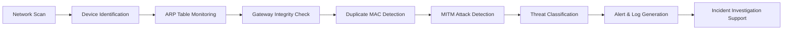

# 🛡️ ShadowScythe – MITM Threat Detection System

## 📘 Overview

ShadowScythe is a network security monitoring and threat detection system designed to identify Man-in-the-Middle (MITM) attacks in real time. The project focuses on detecting ARP spoofing, gateway impersonation, and suspicious network behavior by continuously monitoring network traffic and validating IP-to-MAC address mappings.

The system combines network scanning, ARP table analysis, packet inspection, and automated logging to help security analysts identify malicious nodes before they can compromise network communications.

---

## 🎯 Objectives

* Real-Time Network Monitoring – Continuously inspect network activity and connected hosts.
* ARP Spoofing Detection – Detect duplicate MAC address mappings and ARP table manipulation.
* Gateway Verification – Validate gateway IP-MAC relationships to identify impersonation attempts.
* Threat Logging – Generate logs for incident investigation and forensic analysis.
* Automated Response – Identify and isolate suspicious devices on the network.
* Security Awareness – Demonstrate common MITM attack techniques and defensive strategies.

---

## 🔍 Scope

### ✅ In Scope

#### MITM Attack Detection

* ARP Spoofing Detection
* Gateway Impersonation Detection
* Duplicate MAC Address Detection
* Suspicious ARP Table Monitoring
* Network Device Enumeration
* Security Event Logging

#### Network Monitoring

* Active Host Discovery
* IP Address Identification
* MAC Address Validation
* Gateway Monitoring
* Traffic Inspection Support

#### Security Operations

* Incident Investigation Support
* Threat Detection Logging
* Network Visibility Enhancement
* Attack Surface Monitoring

---

## ⚙️ Methodology

### 1. Network Discovery

* Scan the network and identify active devices.
* Collect IP and MAC address information.

### 2. ARP Table Analysis

* Retrieve ARP entries from monitored systems.
* Compare IP-to-MAC mappings.

### 3. Anomaly Detection

* Detect duplicate MAC addresses.
* Identify abnormal gateway behavior.
* Flag suspicious ARP responses.

### 4. Threat Validation

* Verify detected anomalies.
* Confirm potential MITM indicators.

### 5. Alert & Logging

* Record suspicious events.
* Generate logs for investigation.
* Support forensic analysis.

### 6. Continuous Monitoring

* Re-scan network periodically.
* Detect newly introduced malicious nodes.

---

## 🧩 Expected Outcomes

* Real-time detection of ARP spoofing attacks.
* Identification of malicious devices within a local network.
* Improved visibility into network communications.
* Automated generation of investigation logs.
* Faster incident detection and response.

---

## 🛠️ Technologies & Tools

| Category          | Tools                 |
| ----------------- | --------------------- |
| Programming       | Python                |
| Operating System  | Kali Linux            |
| Network Analysis  | Wireshark             |
| MITM Simulation   | Bettercap             |
| Packet Inspection | Scapy                 |
| Logging           | Python Logging Module |
| Development       | VS Code, GitHub       |

---

## 🏗️ Detection Workflow

---

## 📊 Features

* Real-Time Network Monitoring
* ARP Spoofing Detection
* Gateway Validation
* Duplicate MAC Identification
* Security Event Logging
* MITM Threat Investigation Support
* Lightweight Python-Based Architecture

---

## 🚀 Future Enhancements

* DNS Hijacking Detection
* Machine Learning-Based Anomaly Detection
* Interactive Dashboard
* Email & Telegram Alerts
* SIEM Integration
* Automated Threat Response
